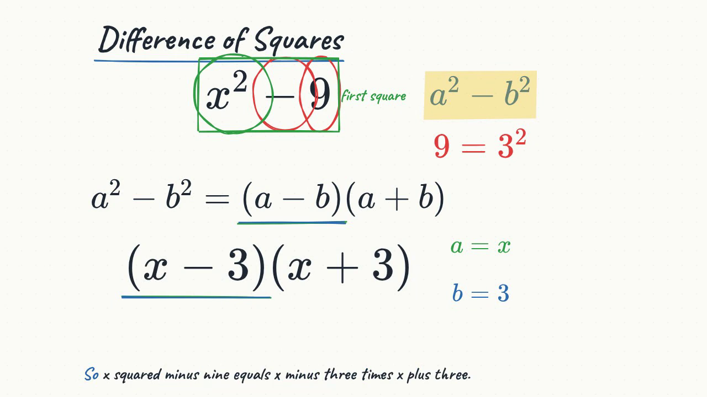
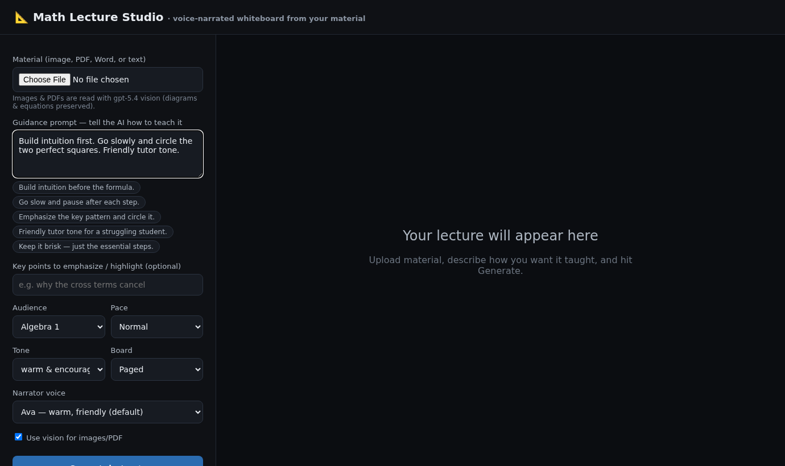

# Lecture Studio — AI-authored, voice-narrated whiteboard lectures

Turn source material (a concept, PDF, Word doc, or image) into a **3Blue1Brown-style lecture**:
a voice that explains while a whiteboard is drawn, highlighted, circled, and annotated *in sync*,
the way a great teacher works at a board.

The system authors a structured **Lecture Score** with an LLM, then plays it back as synchronized
narration + an animated whiteboard in the browser, exportable to MP4. Teachers refine the result
**conversationally** — including by pasting a screenshot of the exact spot they want changed.



---

## Core idea: separate **authoring** from **rendering** with an IR

An LLM is bad at pixels but excellent at producing structured, code-like output. So the system is
split in two, joined by a single intermediate representation — the **Lecture Score**.

```
material ──▶  [ AUTHORING ]  ──▶  Lecture Score (JSON)  ──▶  [ RENDERING ]  ──▶  video
              gpt-5.4 brain        the IR / convention        TTS + whiteboard
```

1. **Authoring** (`src/author.py`): gpt-5.4 reads the material and emits a Lecture Score — a
   constrained, renderer-agnostic JSON description of *what is said* and *what is drawn, when*.
2. **Rendering**: the Score is played back — **voice** via TTS (`src/tts.py`, Azure Speech by
   default with word-level timing) and a **whiteboard** via the interactive web engine
   (`src/player_template.html`, KaTeX + Rough.js), played live and exportable to MP4.

The Score is the valuable, reusable artifact: it drives the live player **and** the MP4 export
without re-prompting the model, and it is what the conversational editor surgically modifies.

---

## Two-stage authoring (default) + optional storyboard review

Long, detailed lectures are hard to author in one shot. The default pipeline decomposes the work:

```
                       ┌──────────────── Stage 1: OUTLINE (cheap) ───────────────┐
material ─▶ ingest ─▶  │ gpt-5.4 "director" plans independent topic SECTIONS:     │
                       │ each = title + script beats (what's said) + visual intent│
                       └──────────────────────────┬──────────────────────────────┘
                                                  │   (optional) STORYBOARD REVIEW
                                                  │   teacher edits the plan via AI chat
                                                  ▼
                       ┌──────────── Stage 2: ELABORATE (parallel) ──────────────┐
                       │ gpt-5.4 "animators" turn each section's plan into precise │
                       │ drawing CUES — in parallel, one section per worker        │
                       └──────────────────────────┬──────────────────────────────┘
                                                  ▼
                              MERGE + validate ─▶ Lecture Score ─▶ render
```

- **2-stage** (default): outline → parallel section elaboration → merge. Roughly **2× faster**
  on long content than single-shot (sections elaborate concurrently) and **more accurate** —
  each animator call has a small, focused job, so referential and layout errors drop. Sections
  are pedagogical units (a topic the audience benefits from seeing as its own page); the
  decomposition helps even at N = 1 by separating *planning* from *drawing detail*.
- **single-shot**: one call authors the whole Score. Still available (`author_mode="single"`).

**Storyboard review** (opt-in checkbox in the UI): run **only Stage 1** first and show the cheap
outline so the teacher can confirm/adjust the overall flow *before* paying for full generation
("merge the last two sections", "add a section on completing the square", "shorten the intro").
The storyboard chat has **conversation memory** (Responses API), so follow-ups like "revert that"
or "a bit shorter still" work naturally. Then **Generate** elaborates the approved outline.

Every Score is JSON-Schema-validated **and** deterministically lint-repaired before rendering —
see *Deterministic validation* below.

### Ingestion (`src/ingest.py`)
Material is read one of three ways:
- **image** (default) — page images are sent **straight to gpt-5.4 (multimodal)** so
  graphs/diagrams are read first-hand (best for rich figures);
- **vision** — transcribed to markdown first;
- **text** — plain extraction.

Image input is capped (default **50**, the OpenAI hard limit); longer PDFs are concatenated to fit.

---

## Conversational editing (the teacher's main control surface)

There is **no manual JSON editing** — teachers refine lectures by talking to the AI. Editing is
conversational at **both** stages, and all of it keeps **conversation memory** across turns.

### Stage 1 — storyboard refine
Before generation, edit the plan in plain language (see above). Whole-outline regeneration (the
outline is small), threaded through the Responses API with `previous_response_id` for memory.

### Stage 2 — multimodal agentic editor
After a 2-stage lecture is generated, the feedback chat is an **agent** (Responses API +
tool-calling). The teacher describes a change **and/or pastes/attaches a screenshot** of the part
they mean (📎 or Ctrl-V). The agent:

1. Holds a lightweight **section table-of-contents** + the conversation (multimodal: it can read
   the screenshot and infer which rendered element you mean).
2. Decides which section(s) the request affects and calls a tool —
   `edit_section(section_ids, instruction)` or `edit_global(instruction)`.
3. The **backend executes** the tool by re-running the focused per-section elaborator on just
   those sections (keeping the agent's own context small), then **re-merges** into a new Score.
4. Only the beats that actually changed are re-synthesized (TTS content-hash cache), so edits are
   fast; the preview reloads automatically. If a request is genuinely ambiguous, the agent asks a
   short clarifying question instead of guessing — and *doesn't* trigger a re-render.

Letting the main editing agent **decide the target sections itself** (rather than a brittle
keyword router) means a vague "make the graph here bigger — see screenshot" lands on the right
page. The section→Score splice is idempotent (re-merges don't accumulate page-break `clear`s).

---

## The Lecture Score convention

Full JSON Schema: [`schema/lecture_score.schema.json`](schema/lecture_score.schema.json).
Authoring guidance the model follows: [`skills/_base.md`](skills/_base.md).

### Synchronization model — **beats and cues**, with word-level timing
A lecture is a list of **beats**. A beat is one spoken sentence (`say`) plus the **cues** (drawing
actions) that happen *while it is spoken*. Each cue is timed two ways:

- `anchor` — **a word copied from `say`** (preferred). Azure Speech inserts an SSML `<bookmark>`
  at that word and reports its exact audio offset, so the cue fires on the spoken word.
  Word-boundary events also drive the **karaoke caption** (the current word lights up).
- `at` — a fraction (0..1) of the beat's spoken duration; the fallback when there's no anchor.

The model never predicts seconds. It says "circle the 9 when I say *nine*" and the renderer fires
it on that word — robust and model-friendly.

### Spoken vs. written math are separated
`say` is plain words ("x squared minus nine"); board objects carry the LaTeX (`x^2 - 9`). This
stops the TTS from mangling notation and keeps the board clean.

### Constrained action vocabulary (safe + reliable + portable)
No arbitrary code is generated — only data from a fixed verb set:

| group | actions |
|---|---|
| create | `write`, `draw`, `plot`/`graph`, `table`, `figure` (geometry), `diagram` (nodes/edges), `image`, `point` |
| transform | `transform` (morph A→B; for a graph, draws the curve through the points), `move`, `erase` |
| annotate | `highlight`, `circle`, `underline`, `strike`, `box`, `brace`, `arrow`, `callout` (leader-line label), `region` |
| attention | `pointer`, `pulse`, `focus` |
| paging | `clear` (wipe to a new page; `keep: [ids]` carries results forward) |

Rich primitives: **`graph`** (axes/curve/points), **`figure`** (hand-drawn geometry), **`diagram`**
(boxes-and-arrows: flows, **cycles**, food webs), **`table`**, and **`image`** (a base picture to
annotate over). **`callout`** draws a leader-line label onto a `spot` of any object — the core way
to label biology diagrams part-by-part.

Objects get an `id`; later cues reference them, and a `part` field targets a sub-expression of an
equation (e.g. `part: "9"`) — the renderer locates it precisely via KaTeX `\htmlId`.

Layout avoids pixel-precision: normalized 0–100 board coordinates, or relative placement (`below`,
`right_of`, anchors with `ref`+`side`). The renderer owns final layout: it **auto-fits, avoids
collisions, and clamps** objects on-board. Graphs/charts are sized **board-relative** (a fraction
of the usable board, clamped to sane min/max) rather than by magic pixel constants, so they look
right regardless of page flow.

### Long lectures: pagination *or* continuous scroll
The board is finite (~6–8 lines). `board.flow` chooses how overflow is handled:
- **`page`** (default) — on overflow or an author `clear`, the renderer **wipes to a fresh page**
  and continues, optionally **carrying key results to the top** via `keep`.
- **`scroll`** — an **endless whiteboard**: content flows downward and a camera pans to follow the
  write head. Here `clear` becomes a **section divider** instead of a wipe. (`--flow scroll`.)

### Example (one beat)
```json
{
  "id": "b4",
  "say": "And nine is also a perfect square, because nine equals three squared.",
  "tone": "curious, lands gently on 'three squared'",
  "cues": [
    { "at": 0.15, "action": "circle", "target": "eq1", "part": "9", "style": { "color": "green" } },
    { "at": 0.55, "action": "write", "id": "note9",
      "object": { "type": "math", "tex": "9 = 3^2" }, "pos": { "x": 72, "y": 36 },
      "style": { "color": "green" } }
  ]
}
```

---

## Deterministic validation (no flaky LLM self-checks)

`validate_score()` (`src/author.py`) is a deterministic linter run on every authored/edited Score
**before** rendering. It checks referential integrity (every `target`/`below`/`right_of`/`keep`
id is created by an earlier cue), part/anchor resolvability, balanced TeX, and value ranges, then
feeds any errors back into a focused repair turn. Run it standalone:

```bash
python src/author.py --lint out/score.json
```

---

## Subjects & SKILL.md packs (the extension point)

The engine is **subject-agnostic**; subjects are a plug-in layer. The teacher **picks a subject up
front** (UI dropdown / `--subject`), which scopes the skill packs. Packs follow the open **Agent
Skills** standard ([agentskills.io](https://agentskills.io)): each is a folder
`skills/<subject>/<skill-name>/SKILL.md` with YAML frontmatter (`name` + `description`). A
lightweight **router** reads only the frontmatter `description` (level-1 progressive disclosure),
picks the relevant packs, and injects their bodies (level-2) alongside the always-on
`skills/_base.md`. Each `SKILL.md` folder is portable — drop one into `~/.claude/skills/` or an
OpenAI Codex skills dir unchanged. See [`skills/README.md`](skills/README.md).

- **Generative subjects** (math, physics) describe shapes/curves the renderer draws precisely.
- **Asset-based subjects** (biology, anatomy) are diagram-driven: build a **schematic**
  (`figure`/`diagram`) or an **`image`**, then **label it part-by-part** with `callout`/`region`.

Shipped: `math/` (factoring, graphing, geometry, calculus) and `biology/` (cell-biology, ecology,
enzyme-kinetics). Adding a subject = a folder of `SKILL.md` packs (+ any new shared primitive).
Authoring runs gpt-5.4 at
`reasoning_effort: "medium"` (`AUTHOR_REASONING` in `src/author.py`; outline uses `"low"`).

---

## Models (Azure OpenAI v1 endpoint)

Auth is **keyless** — an Azure AD bearer token from the logged-in `az` CLI
(`src/azure_client.py`), cached per resource using the token's real expiry. Resource/endpoint
names are read from the environment (a local, git-ignored **`.env`** — see `.env.example`), so no
resource identifiers live in source. Endpoint shape:
`https://<your-resource>.openai.azure.com/openai/v1`.

| role | configured deployment | note |
|---|---|---|
| brain | `gpt-5.4` | **gpt-5.5 was requested** but has **0 quota** in this resource, so it can't be deployed here. Swap one constant (`CHAT_MODEL`) once quota/deployment exists. |
| editing agent | `gpt-5.4` via the **Responses API** | Stateful multi-turn (`previous_response_id`) + tool-calling + multimodal image input — powers the storyboard and Stage-2 editors. |
| voice (default) | **Azure Speech** (`en-US-AvaMultilingualNeural`) | Word-level `<bookmark>` + word-boundary timing → precise cue sync + karaoke. Keyless AAD. |
| voice (expressive) | **MAI-Voice-2** (`en-US-Harper:MAI-Voice-2`, …) | Expressive/multilingual, `mstts:express-as` styles; emits **no** word-boundary events → cues use the `at` fallback (no karaoke). |
| voice (fallback) | `gpt-4o-mini-tts` | Per-clip `instructions` tone steering; no word timing. `--tts openai`. |
| images (default) | **FLUX.2-pro** | Fast text-to-image for science figures; higher RPM. Default backend (`AZURE_IMAGE_BACKEND=flux`). |
| images (edits) | **gpt-image-2** | Image-to-image grounding from source figures (rate-limited to 2 RPM). |

Image generation is **subject-gated** (`IMAGE_SUBJECTS = {biology, physics, chemistry}`): math
lectures draw vectors precisely and skip raster images; science lectures may generate a base image
to annotate over. Voice/model names are single constants (`DEFAULT_SPEECH_VOICE` in `src/tts.py`;
`CHAT_MODEL` in `src/azure_client.py`; voice menu in `server.py`).

---

## Teacher UI (Lecture Studio)

A browser app to drive the whole pipeline without the CLI:

```bash
pip install -r requirements.txt
python -m playwright install chromium    # for MP4 export capture
cp .env.example .env                      # then set your Azure resource/endpoint names
az login
python server.py                         # → http://localhost:5000
```

Upload material (image / PDF / Word / text), write a **guidance prompt** ("build intuition first,
go slow on the factoring step, friendly tone"), and tune **subject, audience, pace, tone, key
highlights, narrator voice, authoring mode** (2-stage default / single-shot), **board flow** (paged
default or endless scroll), **lesson length** (Auto / Concise / Standard / In-depth), and whether
to **review the storyboard** first. A live strip shows `ingest → author → tts → render`, then the
synced lecture plays inline.



- **Storyboard review** (opt-in): confirm/adjust the outline via AI chat before full generation.
- **Feedback chat**: refine the finished lecture over multiple turns — text and/or **screenshots**
  (📎 attach or Ctrl-V paste). 2-stage jobs route through the multimodal agentic editor; single-shot
  jobs continue the authoring conversation. Either way only changed beats are re-synthesized.
- **Download → Video (MP4)**: on-demand export with a progress indicator; the rendered player is
  served instantly at `/download`.

The same pipeline is reusable from code (`src/pipeline.py`), shared by the UI and CLI.

---

## Run it (CLI)

```bash
pip install -r requirements.txt
python -m playwright install chromium
cp .env.example .env                       # set your Azure resource/endpoint names
az login                                   # keyless auth to the endpoint

# material: .md / .txt / .pdf / .docx / image (.png/.jpg/...)
python build.py examples/factoring.input.md            # author + Azure-Speech narration + web player
python build.py examples/factoring.input.md --mp4      # also export out/lecture.mp4 (web capture)
python build.py examples/quadratic_formula.input.md --flow scroll   # endless-whiteboard mode
python build.py examples/cubic.png                     # gpt-5.4 VISION ingest (preserves figures)
python build.py lecture.pdf --ingest-mode text         # plain-text extraction instead of vision
python build.py lecture.pdf --subject biology          # scope skill packs to a subject

# reuse cached stages while iterating on the renderer:
python build.py --skip-author --skip-tts
```

Outputs land in `out/` (git-ignored):
- `out/index.html` — interactive player (open in a browser, press ▶). Sync is driven by the real
  audio playback position + word bookmarks, so it's frame-tight; the caption is karaoke.
- `out/lecture.mp4` — shareable H.264+AAC video from the web engine (burned-in subtitles).
- `out/score.json`, `out/audio/*`, `out/audio_manifest.json` — intermediate artifacts.

---

## Rendering & MP4 export (web engine)

`src/player_template.html` (+ `src/render_web.py`) — interactive, hand-drawn whiteboard:
- Math/text appear with a left-to-right "write-on" reveal; annotations are drawn with **Rough.js**
  (`stroke-dashoffset` draw-on) for a sketched feel.
- Rich primitives: **graph** (axes/curve/points), **chart**, **table** (bordered), **figure**
  (geometry), **diagram** (nodes/edges), **image**.
- **Part targeting** wraps the sub-expression in KaTeX `\htmlId{…}` for an exact bbox; bounding
  boxes use stored board coordinates so annotations stay aligned during scroll/transition.
- Layout engine: auto-fit, collision avoidance, on-board clamp, **pagination** *and*
  **continuous-scroll** (camera follows the write head).
- rAF loop fires cues on word bookmarks (or `at`); karaoke caption from word boundaries.

**MP4 export** (`src/export_mp4.py`): the player runs in a deterministic record/segment mode under
Playwright; the lecture is captured in **parallel segments** (each subprocess records a slice via a
`?seg=a-b` URL with an `INSTANT` prefire + black-mask lead-in), the seams are trimmed with ffmpeg
`blackdetect`, and the slices are stitched + muxed. A ~15-minute lecture exports in ~4 min instead
of ~15 (real-time) capture.

> Web-only by design. SVG is the native vector format for math/geometry, and the browser is
> interactive (the right platform for dynamic geometry). For future 3D, add Three.js/WebGL —
> still web-native.

---

## Status, limitations, next steps

**Working end to end:** ingest (image/PDF/Word/text) → schema-validated, lint-repaired Score
(gpt-5.4, 2-stage or single-shot) → word-synced Azure-Speech narration → interactive web player →
parallel MP4 export. Storyboard review and the multimodal conversational editor are wired into the
UI with conversation memory throughout.

**Known limitations / next steps:**
- **MAI-Voice-2 has no word-boundary events** → those voices lose precise word-sync + karaoke
  (cues fall back to proportional `at` timing). Use Ava for tightest sync.
- **`transform` is a cross-fade**, not a per-glyph morph.
- **Geometry is scaffolded** (core elements); constructions/animation and transformations
  (rotate/reflect/dilate) can be enriched; 3D would need a Three.js path.
- **DOCX layout** uses text + vision on embedded images; full-page Word would need LibreOffice→PDF.
- **Jobs run in-process** in the teacher UI (fine for a demo; production wants a task queue, and
  the `JOBS`/`CTX`/`OUTLINES` in-memory stores reset on restart).
- gpt-5.5 swap-in pending quota (one constant).

---

## Layout
```
server.py                          teacher UI (Flask): upload + guidance -> storyboard -> lecture + edit + MP4
build.py                           CLI orchestrator: ingest → author → tts → render → [mp4]
schema/lecture_score.schema.json   the Lecture Score convention
skills/                            _base.md + skills/<subject>/<skill-name>/SKILL.md packs
src/pipeline.py                    reusable pipeline: run / plan_outline / run_from_outline / refine / agent_refine
src/ingest.py                      ingest: direct image→brain | vision markdown | text; image cap+concat
src/azure_client.py                keyless Azure OpenAI v1 client: chat, Responses API, TTS + image backends
src/author.py                      authoring: single-shot, 2-stage (outline+elaborate), validate_score linter,
                                   refine_outline (storyboard), agent_edit (Stage-2 multimodal editor)
src/tts.py                         narration: Azure Speech (word-sync) | MAI-Voice-2 | OpenAI; content-hash cache
src/player_template.html           KaTeX + Rough.js whiteboard engine (graph/table/figure, scroll, pages, export)
src/render_web.py                  inject Score + audio → out/index.html
src/export_mp4.py                  parallel Playwright segment capture + ffmpeg blackdetect/stitch → out/lecture.mp4
src/capture.py                     headless verification / frame grabs
docs/img/                          README screenshots
examples/                          sample input material
```
